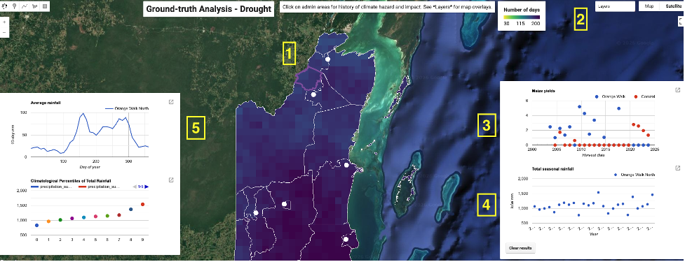
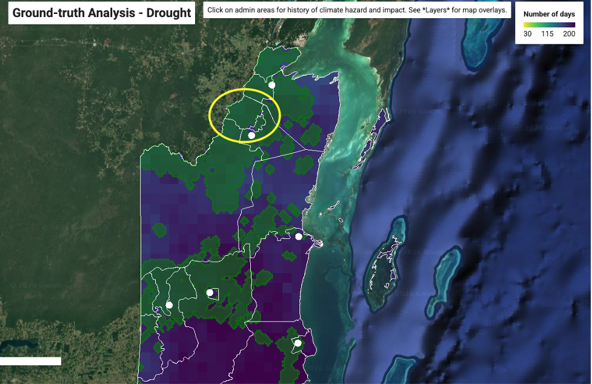
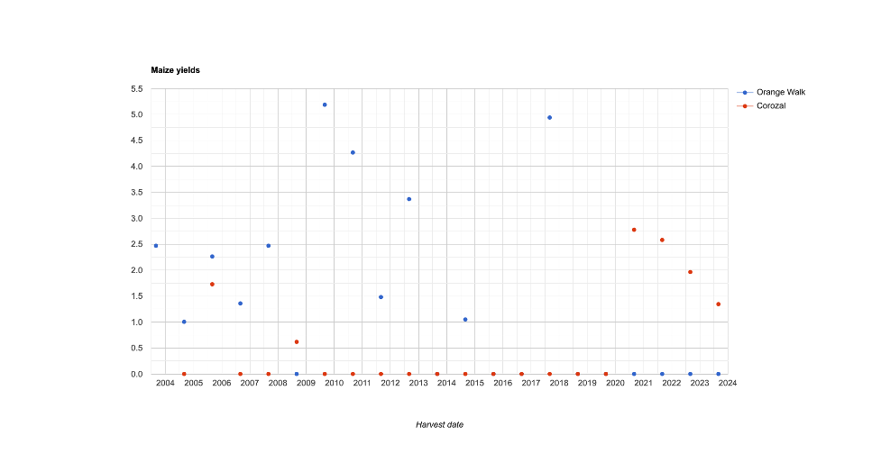
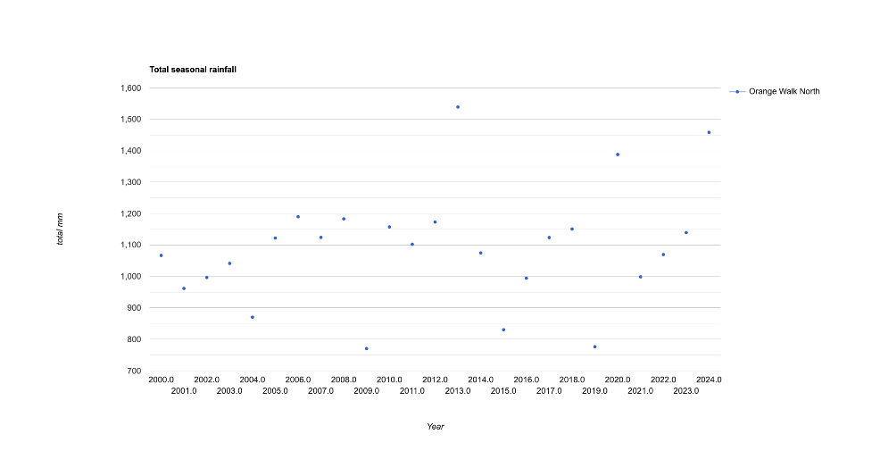
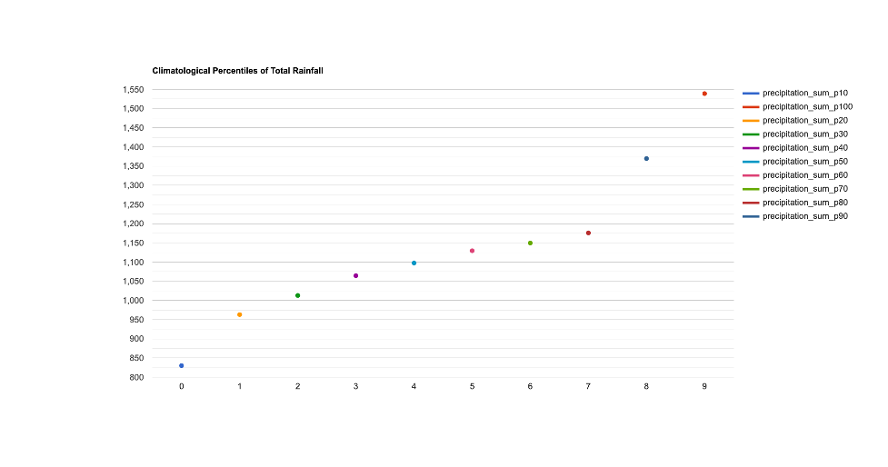
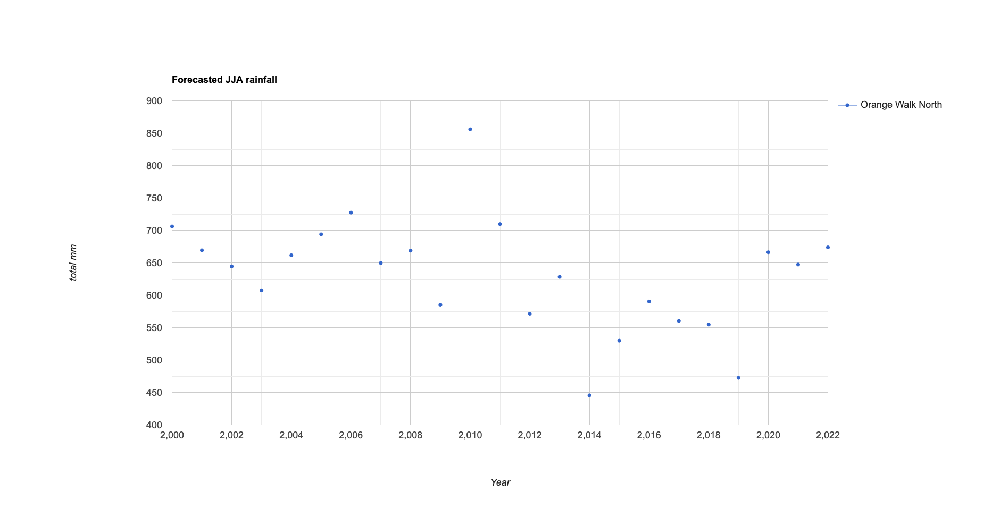

# The Decision Support Maptool

Now that we have defined the key terms and concepts for effective early warning systems, we will turn to a practical exericse in Belize. This exercise will take you through the key features of the Decision Support Maptools that we have developed, and how they can be employed for decision making. 

For this exercise, we will focus on the case of seasonal forecasts of drought for agricultural decision-makers in the Orange Walk district:

https://ee-maxmauerman.projects.earthengine.app/view/belizedrought

## Interacting with the Maptool

- 1. Map: Displays information on long-term propensity for climate hazard, exposure, and vulnerability. Click on an administrative area to add it to the detailed historical analysis.
- 2. Layers: Selects which hazard, exposure and vulnerability layers to display on the map.
- 3. Historical Impact Data: Displays data on climate-sensitive livelihood indicators (in this case, maize yields) in the selected administrative areas in each year for which there is data.
- 4. Historical Hazard Data: Displays climate hazard indicators (in this case, seasonal total rainfall) in the selected administrative areas in each year for which there is data. Also includes forecast data, if available. Click on the “clear results” button to reset the administrative areas used for analysis.
- 5. Climatatology:  Shows information on the average seasonality (top graph) and historical hazard percentiles (bottom graph) for the selected administrative areas.

## Step 1: Geographic Focus

Looking at the map, we see that the Orange Walk North constituency has a comparatively short rainy season, and a large amount of area under agricultural cultivation according to Landsat (green areas). Accordingly, we will select this constituency to focus on for risk analysis. 

## Step 2: Historical Analysis

Clicking on the constituency, we are presented with statistics on climate impact (maize yield in co-located districts) and historical climate hazard (seasonal total JJA rainfall):

While the historical maize yield data is limited, it appears that low rainfall in the years 2004, 2009 and 2015 all coincided with low maize yields in the area. This gives us a basis for issuing sector-specific forecast alerts to farmers in this area. Specifically, we might issue an alert when the seasonal forecast of total rainfall indicates agriculturally risky drought conditions. 

To operationalize this, we must determine a numeric threshold of predicted rainfall below which an alert will be issued. To do this, we turn to climatological analysis:

Comparing this chart to the previous charts, it appears that all of the major agricultural droughts in this area over the past two decades had rainfall below the 20th percentile, which is around 950 millimeters of cumulative precipitation. We will use this as our threshold for issuing drought alerts to farmers in this area. 

## Step 3: Forecast Reliability Assessment

Now that we have studied the observational data to determine a suitable threshold, we will now turn to how will these drought hazards can be forecasted. Here, we use a downscaled forecast of total JJA rainfall that has already been calibrated to conditions in the region. 

Comparing our forecast to observed rainfall, we see that of the major agricultural drought events listed above, the forecast would have identified 2009 and 2015 as significantly below average, but not 2004. This gives us some key information on pratical reliability that we can communicate to decision-makers.

## Step 4: Forecast Communication 

https://ee-maxmauerman.projects.earthengine.app/view/belizemonitor

Once an early warning trigger threshold has been determined, we can monitor the current season forecast (here, 2022 is shown as a example) against observed rainfall to date, and assess how likely it is that the trigger conditions will be met. This monitoring takes into account the prediction uncertainty in the forecast.

The monitoring maptool contains the following information:

- 1. Seasonal forecast data,
- 2. Observed rainfall progression (if we are currently in the middle of the season), as compared against the trigger threshold and the forecasted rainfall by the end of the season,
- 3. Historical years which have had a similar amount of rainfall to date,
- 4. The conditional likelihood of observed rainfall falling below the trigger threshold, as compared to what the forecast predicted at the start of the season. 

This approach could be adapted to a variety of hazards, sectors and timescales.

 

