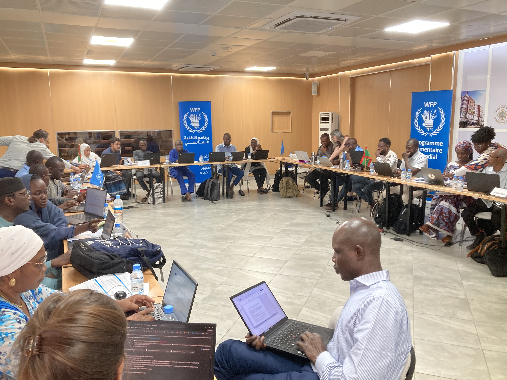

# Belize NMS Multi-Hazard Early Warning Workshop

Reliable early warning systems begin with an understanding of their uses -- the risks they face in context, their informational needs, and the actions they are able to take.

In this workshop, we will work through some practical exercises to illustrates the tools and processes for designing better early warning systems. This workshop is divided into three parts.

The first part of the workshop is a scenario exercise. In this exercise, you will imagine you are a disaster decisionmaker 
thinking about if it is possible to use forecasts to make disaster preparedness actions. It is intended to introduce you to key concepts, terms, analysis, and trade-offs for Anticipatory Action projects.  

In the second part of the workshop, we will introduce the decision support maptool that we have designed to help NMS make these decisions. We will work through a practical exercise in early warning trigger-setting, using the case of seasonal drought forecasts for agricultural preparedness. 

In the third and final part of the workshop, we will show you how these decision support maptools can be adapted to NMS's needs using the simple and freely available Google Earth Engine platform, and have you work through some examples of how they can be customized. This work will be presented during the stakeholder workshop on 18th March, where we will also gather feedback on users' needs and historical climate impacts.

Enter your email to proceed (or any nickname to keep your comments organized):

 

