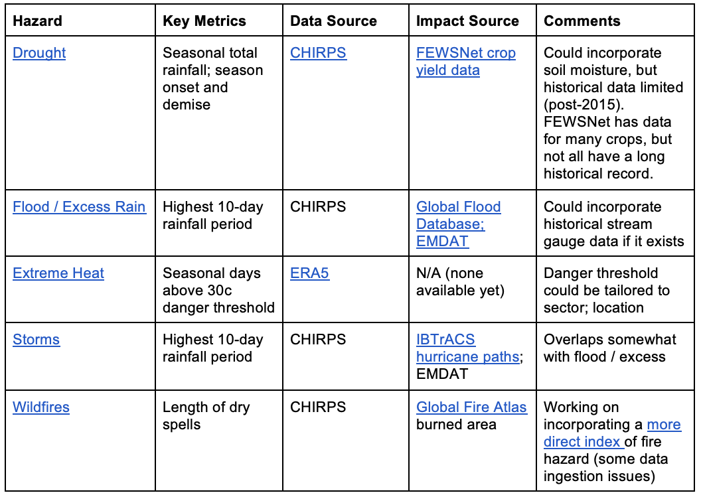
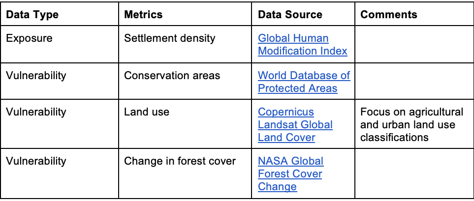
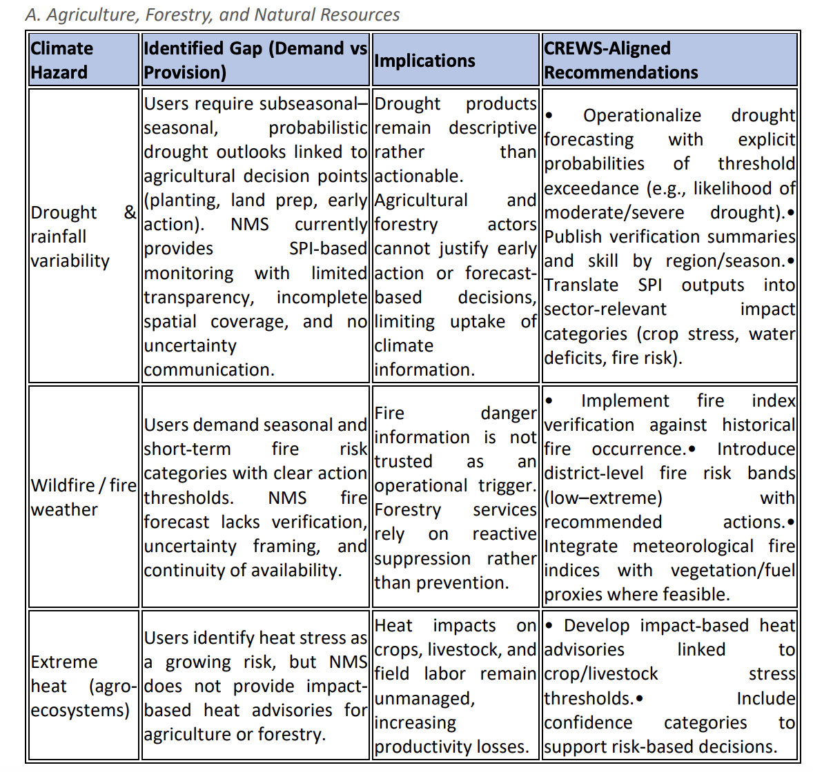
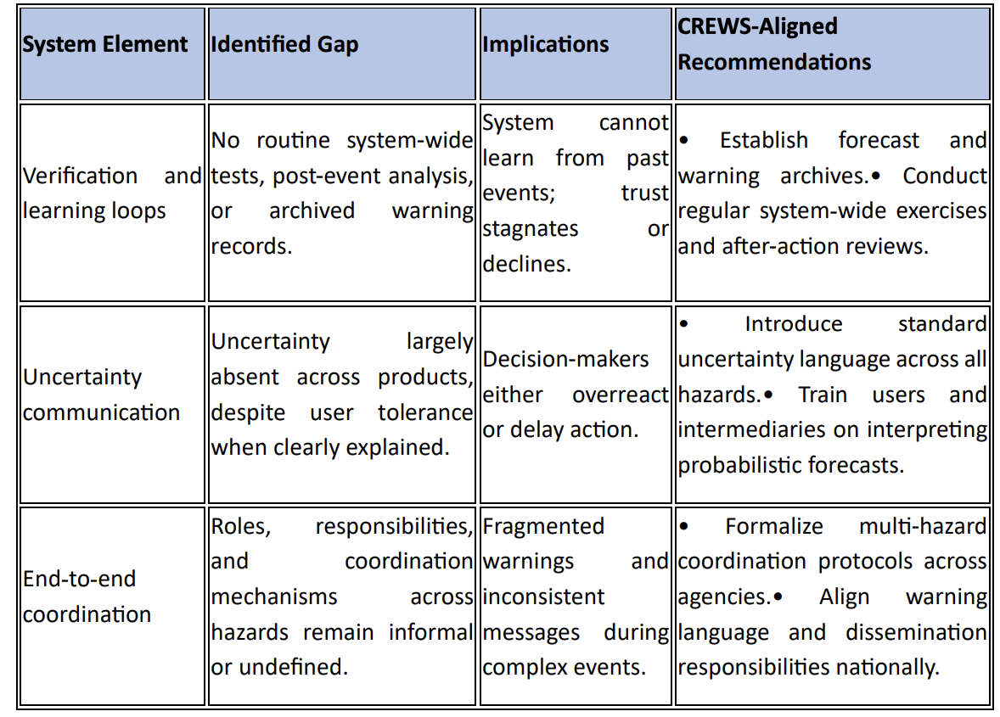
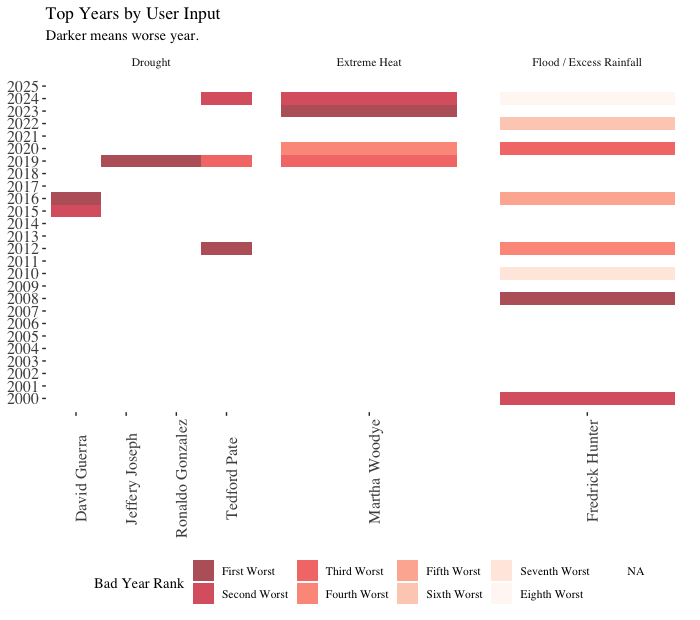
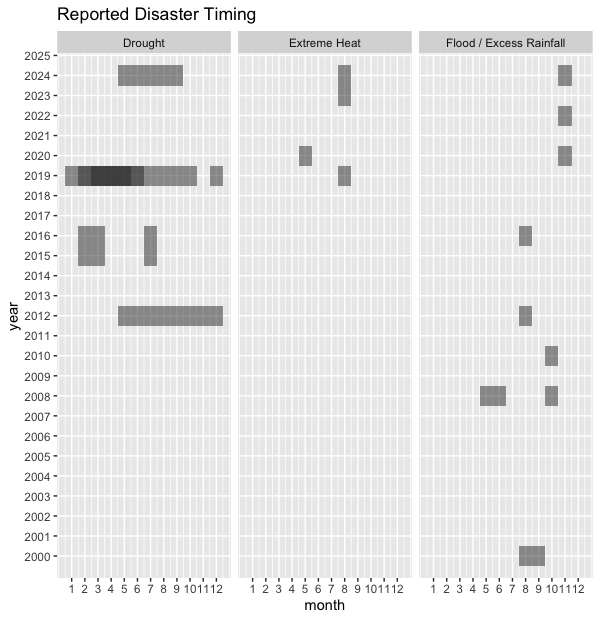

# Multi-Hazard Scoping Exercise

Now, we will broaden our scope to other hazards beyond drought, and assess the available data, including how each hazard might be best measured and forecasted. Tomorrow, we will work through some practical examples of how the Decision Support Maptools might be customized based on this assessment. This scoping exercise will also inform the discussion with stakeholders on 18th March. 

Currently implemented Maptools:

- DROUGHT: https://ee-maxmauerman.projects.earthengine.app/view/belizedrought 
- FLOOD / EXCESS: https://ee-maxmauerman.projects.earthengine.app/view/belizeflood 
- HEAT: https://ee-maxmauerman.projects.earthengine.app/view/belizeheat 
- STORMS: https://ee-maxmauerman.projects.earthengine.app/view/belizestorms 
- WILDFIRES: https://ee-maxmauerman.projects.earthengine.app/view/belizewildfires 

## Hazard Data Sources

Current data sources include:

## Exposure Data Sources

Current data sources include:

## User Needs

Based on previous forecast user need assessments from the Climate Risk Early Warning System (CREWS) project, key needs in Belize include:

## User Bad Years

The below plots summarise the hazards, years and times of year for which stakeholders reported climate impacts.

## Your Feedback

Now it's your turn: Please review each of the maptools above, and provide your feedback about how you would like to see them customized. Tomorrow, we will show how you can use Google Earth Engine to start to tailor the tools to your users' needs.

As you answer these questions, please think both about sources of forecast information that would be useful for institutional decision-makers and sources that would be useful for the general public. These may be different sources of information, at different timescales - if so, please note this in your response. 

 

